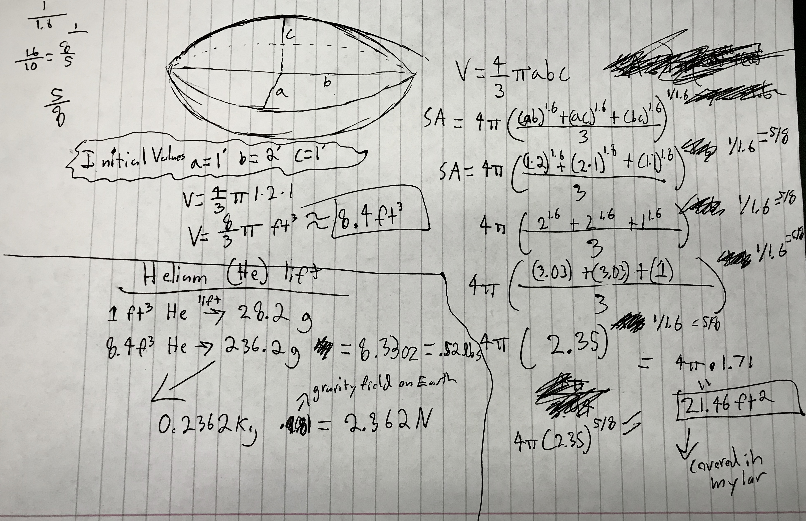
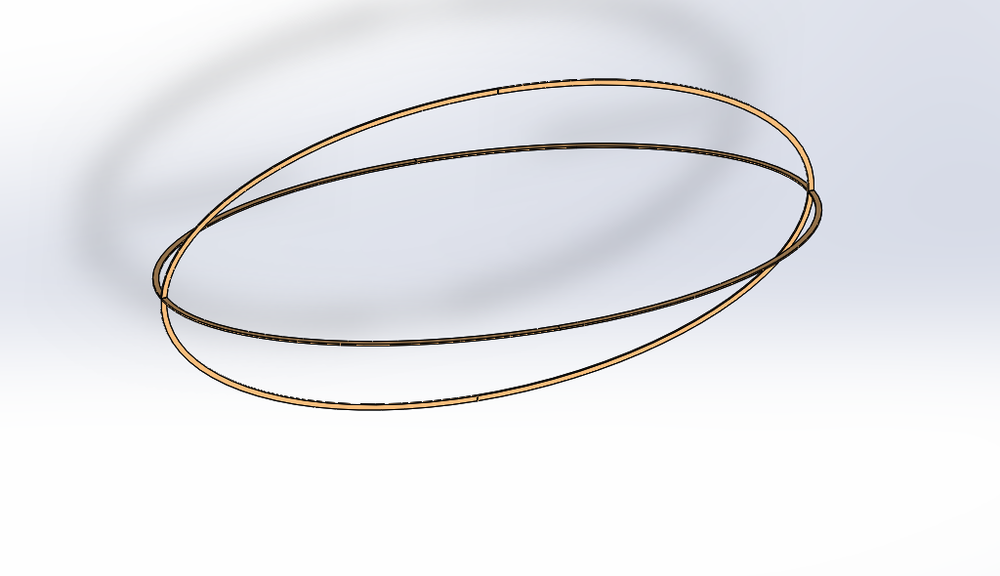

# Mylar Zeppelin: "Stairway to Heaven"
### Pi in the Sky project by Max and Elijah

# Plan
## Objective
The basic goal for this project is to launch a rasberry pi into the sky in some way and take acceleration data while in flight. Also we have to make the pi make some sort of noise at he top of its trajectory.
## Description
For our project we decided to make a blimp, controlled by our pi. The frame with be made of wood and it will be covered in mylar to hold the helium inside of it. We will use bluetooth to connect an xbox controller to the pi and control the motors driving the blimp. We will also use a dual-hbridge to drive a bidirectional motor to move the blimp up and down. On top of this, we will design some sort of hanger door to drop a payload at a specified height. Finally we will make a custom PCB to drive the motors, mount the hbridge, mount the accelerometer, and house all other components to minimize clutter and reduce weight.
## Goal
Our goal is to get the blimp to float to a specified height within range of our controller and track all flight data. At this height, it will trigger a buzzer and drop a small payload to the ground. 
## Constraints
The price of helium is pretty high and the other parts can add up. The weight of the frame and the components need to be approximately equal to the up force exerted by the helium. This means figuring out the total weight before picking final dimensions for the blimp so that the heliums force is slightly greater than the total weight. Also, the range of the bluetooth connection between the pi and the controller will limit how far we can go.
## Materials
* Mylar
* Wood for frame
* Pi Zero
* L293D Dual-hbridge
* 3 mini dc motors
* Helium
* Custom PCB
* Accelerometer
* Alarm buzzer
* Xbox Controller
## Rough Schematics and Equations

## Schedule
* Week 1(October 28):Figure out how to control motors with xbox controller, create a basic design for blimp
* Week 2:Finish with xbox controller, continue on design, start on code to store data
* Week 3:Start on PCB, work on code for accelerometer, finish preliminary design
* Week 4:Work on PCB, test ways to seal mylar for the blimp, start cutting out frame, work on code
* Week 5:Finish PCB, start assembling frame and test covering it, start on final code
* Week 6:Work on final code, continue on frame
* Week 7:Work on final code, finish first frame design
* Week 8:Work on final code, test filling the blimp and see if it floats
* Week 9:Work on final code, redesign/edit frame and covering
* Week 10:Test blimp flight, test code
* Week 11:Test code and flight
* Week 12:Final flight and dropping with full code.

## Changes
* Custom mylar balloon to buying weather balloon: We realized that creating a custom Mylar balloon would be a lot more difficult than we originally thought, especially sealing it. So, instead we are planning to buy a large weather balloon, and we're going to expand it into the blimp cage so we can get the correct dimensions for the blimp.

# The Blimp
## Code
We wrote all of our code in Python. Our code utilizes the `evdev` library to read the inputs from an Xbox One S wireless controller connected to the Pi via bluetooth. Next we send the data from the controller to the three DC motors, two can only go one direction (right and left), and one is hooked up to a L293D Dual H-Bridge so it can go two directions (for up and down). Using `threading`, we can also collect data from the accelerometer and altimeter simultaneously with controlling the motors. We're using an **Adafruit LSM303 Accelerometer** and an **Adafruit BMP100 Altimeter**. Then, using the `csv` library, we can take all the data we've collected and store it in a .csv file saved on the pi, which we can use to create spreadsheets or any visual representation of the *x*, *y*, and *z acceleration*, as well as the *temperature*, *pressure*, and *altitude* of the flight. [Here's the code](https://github.com/etolton49/Pi-in-the-Sky/blob/master/Pi_in_sky.py)

## PCB
In order to make the blimp move and collect data, we first needed to build a circuit that powered 3 DC motors and used 2 sensors. We first created a motor circuit controlling 2 DC motors with transistors, and 1 DC motor with an L293D dual H-bridge, so that we could spin the motor clockwise and counter-clockwise to lift or lower the blimp. Then we chose 2 sensors to attach to the blimp: an LSM303 accelerometer and a BMP180 barometric sensor. Once the ciruit was built, we realized we needed to create a PCB to minimize the space this circuit takes up.
### The process
One thing that made this PCB especially
